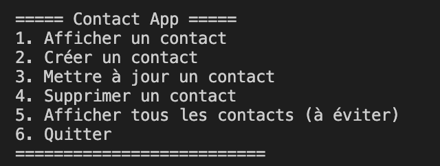

# Procédure d'installation - lokiJS

## Contexte

Un ordinateur neuf avec d'installer juste l'OS

## Installation de Homebrew 

Homebrew est un gestionnaire de package permettant une installation rapide et propre sur votre machine

Ouvrez un terminal, vous pouvez l'ouvrir avec la recherche 'Spotlight' [**cmd** + **Space**]

```bash
/bin/bash -c "$(curl -fsSL https://raw.githubusercontent.com/Homebrew/install/master/install.sh)"
```

## Installation des outils pour utiliser la base de donnée

Toujours dans un terminal, vous allez pouvoir utiliser homebrew pour installer node et git

### Installation de node

```bash
brew install node
```

1. Vous pouvez vérifier si node est bien installer avec la commande :
	```bash
	node --version
	```

2. Vérifier si npm à bien été installer avec la commande  :
	```bash
	npm --version
	```

### Installation de git

```bash
brew install git
```
1.  Collez le texte ci-dessous en indiquant l’adresse e-mail de votre compte sur GitHub.
    
    ```shell
    $ ssh-keygen -t ed25519-sk -C "YOUR_EMAIL"
    ```
    
    **Remarque :**  Si la commande échoue et que l’erreur  `invalid format`  ou  `feature not supported,`  se produit, vous utilisez peut-être une clé de sécurité matérielle qui ne prend pas en charge l’algorithme Ed25519. Entrez plutôt la commande suivante.
    
    ```shell
    $ ssh-keygen -t ecdsa-sk -C "your_email@example.com"
    ```
    
2.  Quand vous y êtes invité, appuyez sur le bouton de votre clé de sécurité matérielle.
    
3.  Quand vous êtes invité à entrer un fichier dans lequel enregistrer la clé, appuyez sur Entrée pour accepter l’emplacement du fichier par défaut.
    
    ```shell
    > Enter a file in which to save the key (/Users/YOU/.ssh/id_ed25519_sk): [Press enter]
    ```
    
4.  Quand vous êtes invité à taper une phrase secrète, appuyez sur  **Entrée**.
    
    ```shell
    > Enter passphrase (empty for no passphrase): [Type a passphrase]
    > Enter same passphrase again: [Type passphrase again]
    ```
    
5.  Ajoutez la clé SSH à votre compte sur GitHub. Pour plus d’informations, consultez « [Ajout d’une nouvelle clé SSH à votre compte GitHub](https://docs.github.com/fr/authentication/connecting-to-github-with-ssh/adding-a-new-ssh-key-to-your-github-account) ».


## Cloner le projet

1. Encore dans un terminal, placez vous dans le dossier où vous voulez enregistrer le projet et entrez la commande :
	```bash
	git clone git@github.com:Lucas-Barthelemy/NoSQL.git
	```

2. Une fois le projet cloné, rentrez dedans :
	```bash
	cd NoSQL
	```

3. Installer les dépendances du projet avec la commande :
	```bash
	npm install
	```

## Utiliser le CRUD

Vous pouvez maintenant utiliser le crud en lançant la commande :

```bash
node crudApp.js
```



1. Afficher un contact grâce à l'id

2. Créer un nouveau contact en rentrant toutes ses informations, il vous le montrera et vous dira avec quel ID il a été crée

3. Mettre à jour un contact en changeant au moins un champs

4. Supprimer un contact grâce à son ID, il vous le montrera et vous demandera une confirmation

5. Afficher tous les contacts, attention il y a beaucoup d'entrées dans la base de donnée

6. Quitter l'application